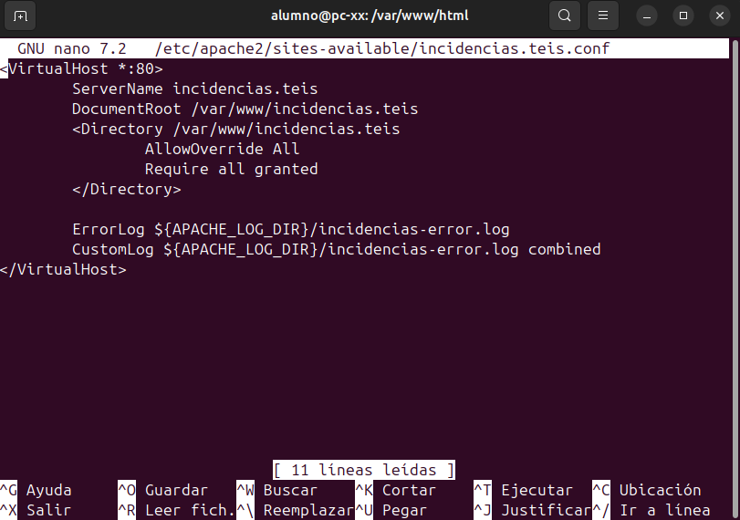

# Manual de instalación de la aplicación web

## Decisiones de proyecto

|Elemento|Decisión|Versión|Justificación|
|--------|-------|--------|-------------|
|Servidor Web|Apache|2|Sencillo de usar, popular|
|Base de datos|MySQL|8|Experiencia previa, popular|
|Lenguaje servidor|Python|3|Muy interesante para ASIR, uso extendido|
|Framework|Flask|3|Sencillo de usar, pensado específicamente para web (formularios, sesiones)|
|Control de versiones|Git|2|Muy extendido|
|Documentación|Markdown|-|Muy utilizado con github|

## ¿Qué hace un servidor web?

Recibe peticiones HTTP y devuelve recursos al navegador

## Proceso de instalación / puesta en marcha

1. Actualizar el sistema
```bash
sudo apt update
sudo apt upgrade
```
2. Instalar git
```
sudo apt install git
```
3. Instalar VS Code + Plugins:
    - Markdown all in one

4. Instalar Apache2
`sudo apt install apache2`
5. Cambiar permisos carpeta /var/www/html
```bash
sudo chown -R $user:$user /var/www/html
sudo chmod -R u=rwx,go=rx /var/www/html
```
6. Configuración apache

   -  Crear un archivo index html en la carpeta /var/www/incidencias.teis con la página principal de incidencias.
   
   - Hacer visible la página con el nombre incidencias.teis en la configuración de apache.



   - Desactivar el sitio configurado por defecto en apache
```bash
sudo a2dissite 000-default.conf
```

   - Activar el sitio de incidencias.teis 
```bash
sudo a2ensite incidencias.teis.conf
```

7. Instalar mysql server

```bash
sudo apt install mysql-server
```

8. Configuración mysql
```sql
-- crear la base de datos incidencias
create database incidencias;

-- crear el usuario incidencias
create user 'incidencias'@'localhost' identified by 'incidencias';

-- darle todos los permisos al usuario incidencias para toda la base de datos incidencias
grant all privileges on incidencias.* to 'incidencias'@'localhost';

-- crear la tabla de los registros de las incidencias
create table registro( id int auto_increment primary key, aula varchar(30), usuario varchar(20), descripcion text, estado varchar(30) );

-- crear registros de prueba
insert into registro (aula, usuario, descripcion, estado) values ('Taller 1', 'alcerqueira', 'PC 24 no arranca', 'ABIERTA'),('Taller 1', 'alcerqueira', 'Proyector no se ve nitido', 'ABIERTA');
```

## Configuración de git/github

1. Crear repositorio local, añadir archivos y commit
```bash
git init
git add .
git commit -m "comentario"
```
2. Crear cuenta github, crear repositorio en github.

3. Conectar repositorio local con remoto
```bash
git remote add origin url-repositorio
git branch -M main
git push -u origin main
```